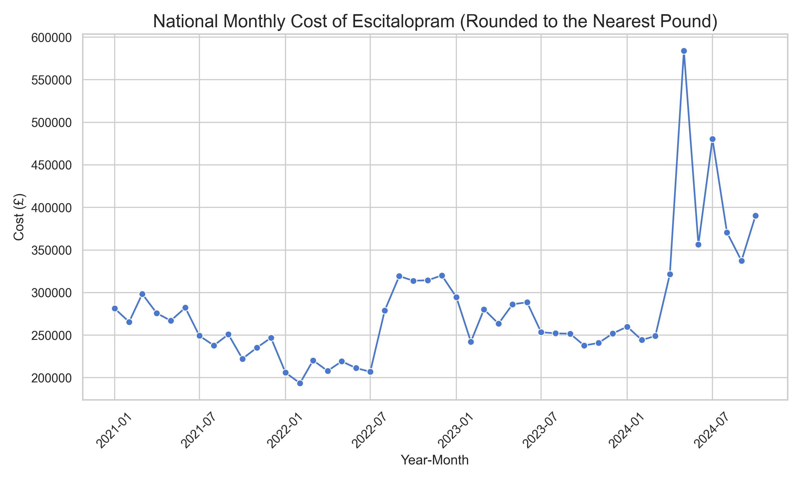

# NHS DigData Step-Up Challenge – Antidepressant Prescribing Analysis

## Project overview

This repository contains a Jupyter notebook that was completed as part of the **NHS DigData Step-Up Challenge**.  
The aim of the project is to explore and visualise national antidepressant prescribing using the NHS Business Services Authority (NHSBSA) **Prescription Cost Analysis (PCA)** dataset.

The notebook walks through:

- Loading and understanding the PCA regional drug summary data  
- Cleaning and preparing the `YEAR_MONTH` and drug fields  
- Answering specific challenge questions about antidepressant prescribing  
- Creating visualisations for key trends  
- Generating summary metrics and insights on volume and cost

---

## Dataset

- **Source:** NHSBSA Open Data Portal – *Prescription Cost Analysis (PCA) monthly data*  
  - URL: https://opendata.nhsbsa.net/dataset/prescription-cost-analysis-pca-monthly-data
- **Main file used:** `BSA_ODP_PCA_REGIONAL_DRUG_SUMMARY.csv` (cloned from the `nhsengland/Digdata` GitHub repo)

Key columns used in the analysis include:

- `YEAR_MONTH` – Year and month in `YYYYMM` format  
- `REGION` – NHS region  
- `BNF_CHEMICAL_SUBSTANCE` – Drug / chemical substance name  
- `ITEMS` – Number of prescription items  
- `COST` – Prescribing cost (in GBP)

The data is openly available and anonymised.

---

## Main analysis steps

### 1. Setup and data loading

- Clone the official **Digdata** GitHub repository:
  ```bash
  git clone https://github.com/nhsengland/Digdata
  ```
- Load `BSA_ODP_PCA_REGIONAL_DRUG_SUMMARY.csv` into a pandas DataFrame.
- Inspect the structure and summary statistics to understand the size and layout of the dataset.

### 2. Data cleaning and preparation

- Treat `YEAR_MONTH` as a string to handle inconsistencies.
- Remove invalid `YEAR_MONTH` entries where the month part is `00` or greater than `12`.
- Convert valid `YEAR_MONTH` values into proper datetime objects.
- Create cleaned datasets such as:
  - National **monthly total prescribing cost** for all drugs
  - Monthly cost time series for **specific antidepressants** (e.g. escitalopram)
  - Subsets by region and drug name

### 3. Challenge questions – Part 1

The notebook answers a number of specific analytical questions, for example:

- Calculate the **monthly national cost** of **mirtazapine** prescribing.
- Calculate the **annual spend** on **sertraline hydrochloride** in a specific region (e.g. the Midlands).
- Identify which antidepressants are most frequently prescribed nationally by total number of items and total cost.

These questions are answered using grouped aggregations, filtering by `BNF_CHEMICAL_SUBSTANCE`, and summarising `ITEMS` and `COST`.

### 4. Visualisation – Part 2

Several visualisations are created to make the results easier to interpret, including:

- A **horizontal bar chart** of the **top 5 most prescribed drugs in 2024**, sorted in descending order of item volume.
- A **vertical bar chart** showing the total annual cost of sertraline prescribing for a chosen region (for example, the North West).
- A **line chart** of the national monthly cost of **escitalopram**, rounded to the nearest pound.
- A **line chart** of the total national monthly prescribing cost across all drugs.

These plots use `matplotlib` and `seaborn` to show trends, highlight peaks and troughs, and compare different years.

### 5. Metrics & insights – Part 3

The notebook then moves into higher-level metrics and insight generation:

- **Annual summary statistics** (min, Q1, median, Q3, max) for the monthly national prescribing cost, grouped by year.
- A **grouped boxplot** comparing the distribution of monthly costs between years (e.g. 2021–2024), to see how variability and central tendency change over time.
- An antidepressant-focused summary that:
  - Aggregates **total items** and **total cost** by `BNF_CHEMICAL_SUBSTANCE`
  - Calculates each drug’s **percentage share** of the total antidepressant volume and cost
  - Computes the **mean cost per item** for each antidepressant
- A more detailed look at a **specific antidepressant** (such as escitalopram), where:
  - Monthly items and cost are aggregated over time
  - Trends in volume and cost are plotted to highlight changes and possible seasonality

---

## Key visualisations

> 💡 Save your plots from the notebook into an `images/` folder with the filenames shown below so they render automatically on GitHub.

### National monthly antidepressant prescribing cost

```python
plt.savefig("images/national_monthly_cost.png", dpi=300)
```


---

### Monthly escitalopram prescribing cost

```python
plt.savefig("images/escitalopram_monthly_cost.png", dpi=300)
```



---

### Top 5 most prescribed antidepressants in 2024

```python
plt.savefig("images/top5_antidepressants_2024.png", dpi=300)
```


---

### Distribution of monthly national cost by year (boxplot)

```python
plt.savefig("images/monthly_cost_boxplot_by_year.png", dpi=300)
```


---

## Key findings (high-level)

Some key messages that emerge from the analysis include:

- A small set of antidepressants (for example, drugs like escitalopram and fluoxetine) contribute a **large share of total items and total spend**, making them important for both clinical and cost planning.
- Some medicines have a **high mean cost per item** despite lower prescribing volumes, which can still have a significant budget impact and may warrant closer monitoring.
- The **distribution of monthly national cost** changes over time, with different years showing different ranges and medians rather than a flat or static pattern.
- Time-series plots for key antidepressants suggest ongoing trends and potential **seasonal patterns**, which could be related to service demand, guideline changes or mental health awareness activities.

These insights are intended as a starting point for further exploration rather than definitive clinical conclusions.

---

## How to run the notebook

1. **Clone this repository**

   ```bash
   git clone https://github.com/<your-username>/<your-repo-name>.git
   cd <your-repo-name>
   ```

2. **(Optional) Create and activate a virtual environment**

   Using `venv`:

   ```bash
   python -m venv .venv
   # On Windows:
   .venv\Scripts\activate
   # On macOS / Linux:
   source .venv/bin/activate
   ```

3. **Install dependencies**

   You can either use a `requirements.txt` file or install the main libraries directly:

   ```bash
   pip install pandas numpy matplotlib seaborn jupyter
   ```

4. **Download the data**

   Option A – Let the notebook clone the Digdata repo (recommended):

   - Ensure `git` is installed.
   - In the notebook, run the first cell:
     ```bash
     git clone https://github.com/nhsengland/Digdata
     ```
   - Confirm that `BSA_ODP_PCA_REGIONAL_DRUG_SUMMARY.csv` is available under the `Digdata/` folder.

   Option B – Manual download:

   - Visit the NHSBSA Open Data Portal and download the PCA file.
   - Save `BSA_ODP_PCA_REGIONAL_DRUG_SUMMARY.csv` into a `Digdata/` folder next to the notebook.

5. **Launch Jupyter and open the notebook**

   ```bash
   jupyter notebook
   ```

   Then open:

   - `NHS_DigData_Step_Up_Challenge_Analysis.ipynb`

   and run the cells from top to bottom.

---

## Repository contents

- `NHS_DigData_Step_Up_Challenge_Analysis.ipynb`  
  Main analysis notebook that contains all data preparation, analysis, visualisation and commentary for the NHS DigData Step-Up Challenge.

- (Optional, generated by the notebook)  
  - `national_prescribing_monthly_cost.csv` – Cleaned monthly national prescribing cost across all drugs.  
  - `escitalopram_monthly_cost.csv` – Cleaned monthly national cost for escitalopram.

You can choose whether or not to commit the generated CSV files to your GitHub repository.

---

## Technologies used

- **Python**
- **pandas** for data loading, cleaning and aggregation
- **NumPy** for numerical operations
- **Matplotlib** and **Seaborn** for visualisations
- **Jupyter Notebook** for interactive analysis

---

## Acknowledgements

- Data provided by **NHS Business Services Authority (NHSBSA)** via the **NHSBSA Open Data Portal**.
- Notebook created as part of the **NHS DigData Step-Up Challenge – Step Up programme**.

---

## Disclaimer

This project is for learning and demonstration purposes only.  
The analysis is based on openly available data and does **not** represent official NHS analytics, advice or policy.
